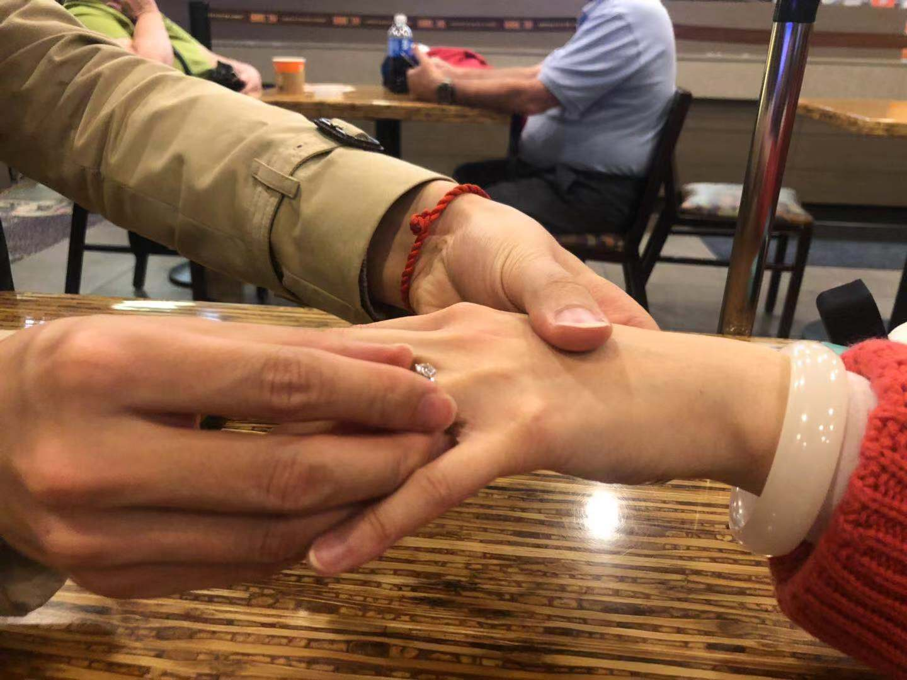
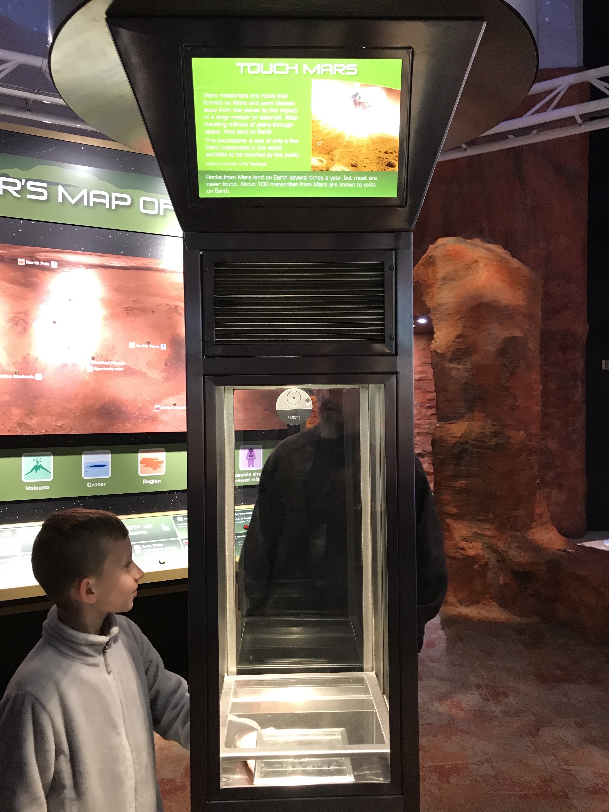

## HELLO!
欢迎来到这个空间。这里记录了一张张照片的故事。  

关于我的50问  

### 神游

####如果有这样一间餐厅......

### 旅行
#### Las Vegas

      关于结婚  
&emsp;&emsp;如果你有这样的困惑，什么样的情况或者说契机下，两个人会想要结婚，其实是在困惑，是什么样的特殊性会让自己觉得，要主动选择这个人作为自己法律上，大多数情况下也是社会关系上的配偶。尤其是在现在这个时空，人与人的接触方式多且快。要不要结婚都已经成了现在年轻人的困惑。人生经验有限的我也思考过这个问题，且依旧没有答案。或者这个问题本身并没有什么普世的答案。但至少，现在的我已经不是完全没有头绪了。  
&emsp;&emsp;首先我感受到的是，在做人生大决定的时候往往是快的，凭感觉，无来由的。你只是想要去做罢了，没有什么理由。在面对小事的时候，我们反而可以细细考虑，慢慢比较，甚至做出了全面的分析后再做决定。对于结婚这件事，世界上并没有所谓的对的人。即使是传说中的灵魂伴侣乃至双生火焰，其出现往往都伴有相应的功课。  
&emsp;&emsp;第二是，选择一个人结婚，其实是在选择自己以后想要的生活方式。每个人都有很多的面相，选择一个人一起生活，除了是喜欢对方之外，更是喜欢在对方面前的自己。
      
      
      

#### Houston
      火星上的石头

### Support or Contact

Having trouble with Pages? Check out our [documentation](https://help.github.com/categories/github-pages-basics/) or [contact support](https://github.com/contact) and we’ll help you sort it out.
